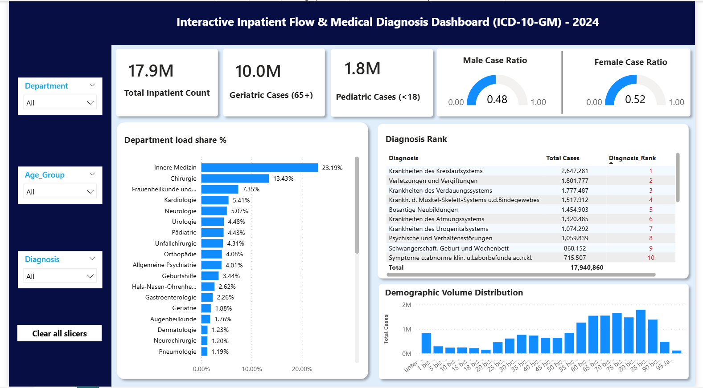

# 🏥 ICD-10-GM Clinical Intelligence & Inpatient Flow Dashboard

An interactive clinical intelligence solution built in **Power BI Desktop** analyzing **17.9M inpatient hospital admissions** across Germany, based on official public health census data from the **German Federal Statistical Office (Destatis)**.

---

## 📊 Dashboard Preview

---

## 📌 Project Overview & Objectives

* **Source:** German Federal Statistical Office (*Statistisches Bundesamt - Destatis*).
* **Scope:** 17.9M inpatient hospital census records classified under the official **ICD-10-GM** (German Modification) clinical taxonomy.
* **Goal:** Ingest unstructured hospital census records, resolve data anomalies (double-counting defects), model dimensional relationships, and engineer an executive-level operational dashboard.

---

## 🔄 Data Pipeline & ETL Workflow

* **Data Cleaning (Power Query):**
  * Filtered out pre-calculated `"Insgesamt"` (total) aggregate rows to eliminate a 100%+ double-counting defect.
  * Unpivoted nested demographic columns into normalized key-value pairs.
  * Replaced delimiter anomalies across semicolon-separated values.
* **Language Hybridization:**
  * Built an English user interface shell while preserving native German ICD-10-GM clinical classifications to maintain data integrity.
* **Chronological Sorting:**
  * Created a custom sorting index to override Power BI’s default alphabetical sorting on age brackets (e.g., *unter 1 Jahr*, *1 bis unter 5 Jahre*, etc.).

---

## 📈 Key Dashboard Metrics

* **Total Inpatient Count:** 17.9M baseline hospital admissions.
* **Geriatric Cases (65+):** 10.0M admissions (~56% of total volume).
* **Pediatric Cases (<18):** 1.8M admissions (~10% of total volume).
* **Gender Ratio:** 0.52 Female / 0.48 Male case balance.
* **Leading Department:** *Innere Medizin* (Internal Medicine) leading network utilization at **23.19%**, followed by *Chirurgie* (General Surgery) at **13.43%**.
* **Top Diagnosis:** *Krankheiten des Kreislaufsystems* (Cardiovascular Diseases) with **2.65M cases** ranked #1.

---

## 🛠️ Technical Stack

* **Business Intelligence:** Microsoft Power BI Desktop
* **ETL & Data Transformation:** Power Query (M Language)
* **Calculations & Metrics:** Data Analysis Expressions (DAX)
* **Data Modeling:** Star-Schema Dimensional Design

